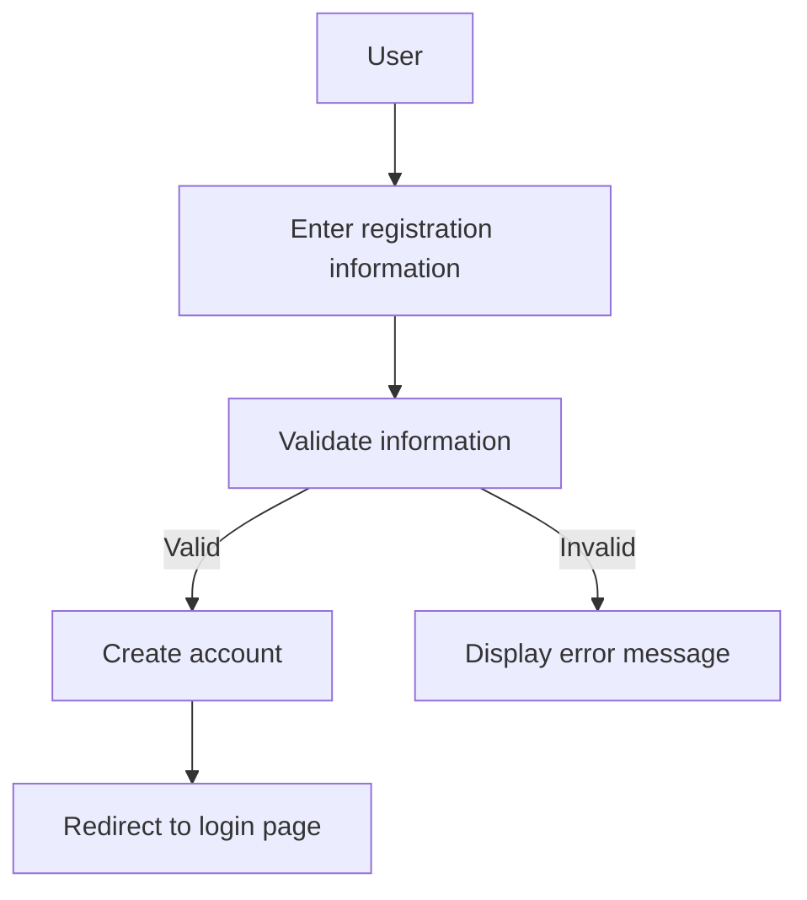
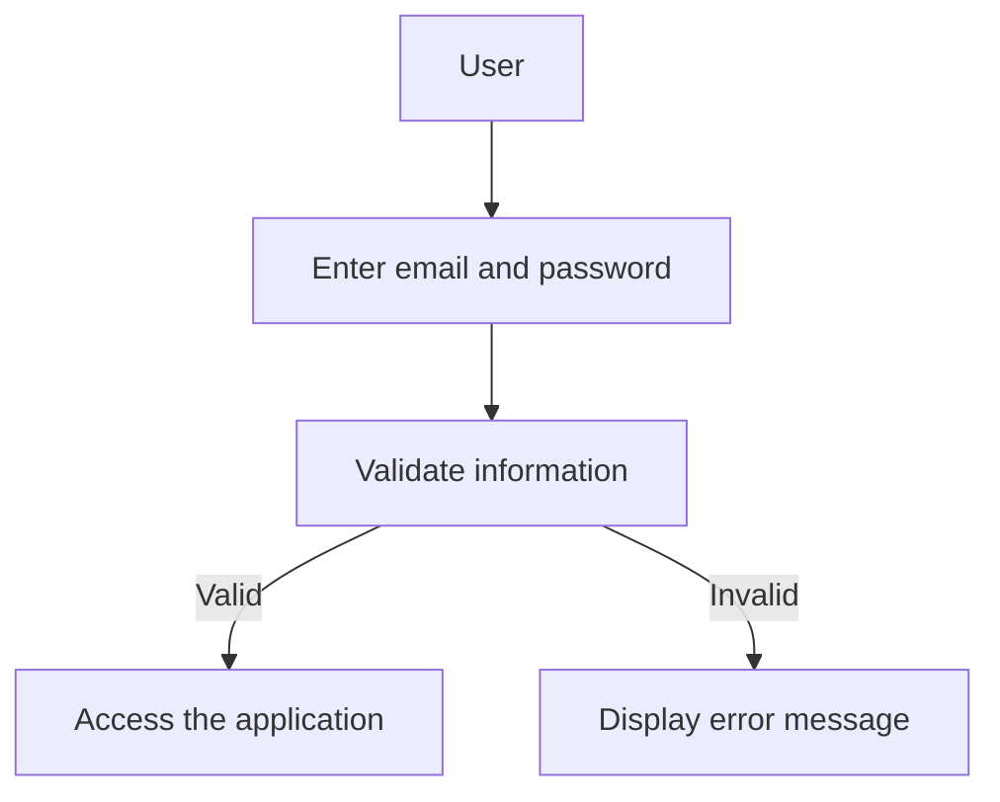
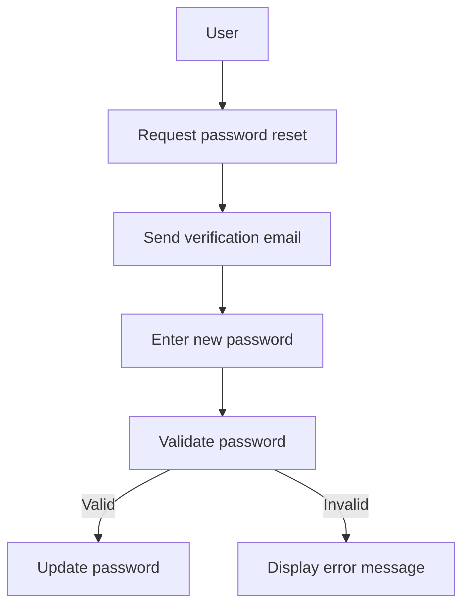
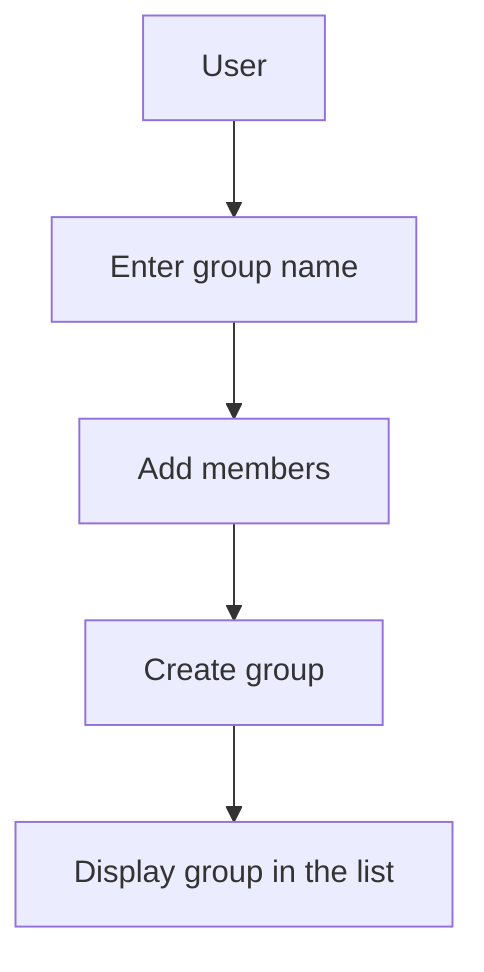
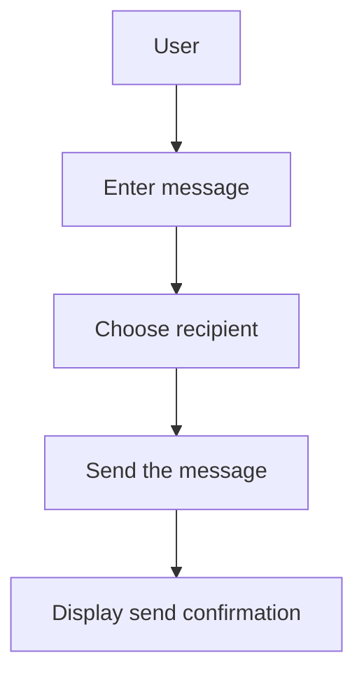
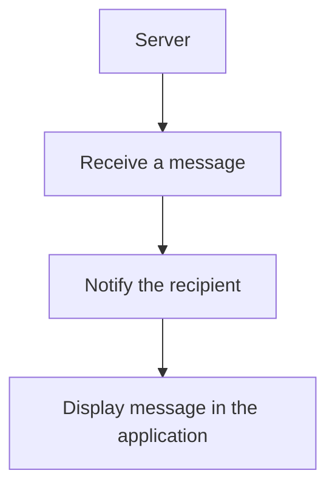
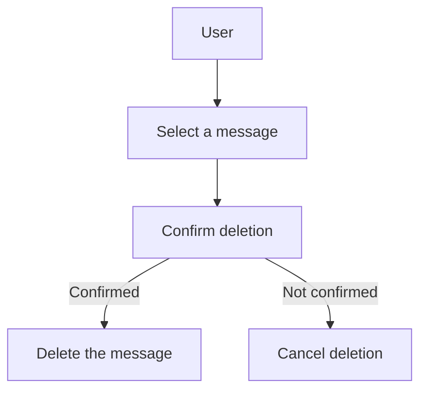
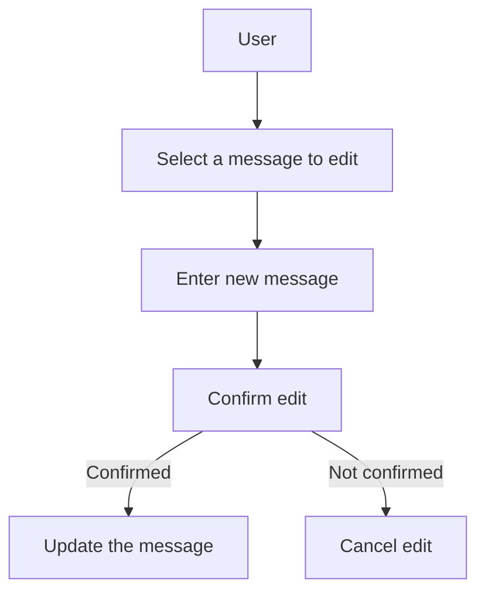
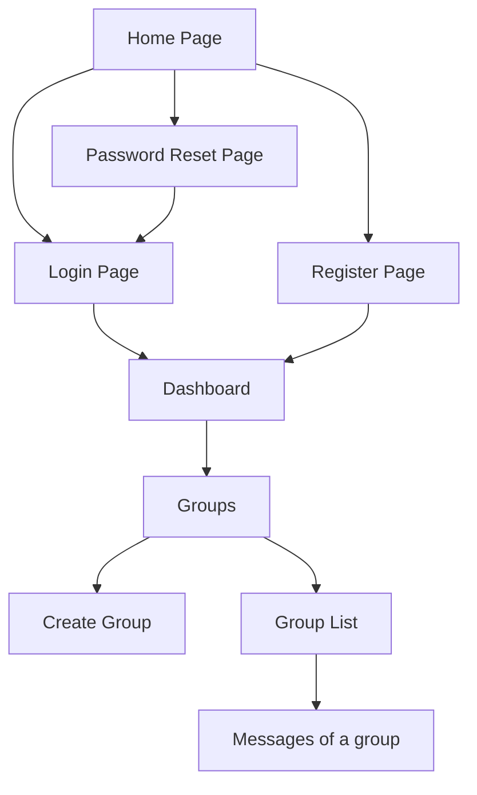

# Messenger
## Contexte

Ce projet est une application développée en Symfony, conçue pour remettre à niveau mes compétences en PHP et Symfony après plusieurs années d'absence. Il s'agit d'une expérience d'apprentissage visant à explorer les concepts de Clean Architecture, Test-Driven Development (TDD), Domain-Driven Design (DDD) et l'architecture hexagonale. Ces approches visent à créer un code maintenable, extensible et testable.

## Technologies

 - **Symfony** : Framework PHP pour le développement d'applications web.
 - **PHP** : Langage de programmation utilisé pour la logique métier.
 - **Composer** : Gestionnaire de dépendances pour PHP.
 - **PHPUnit** : Outil pour les tests unitaires.

## Concepts clés
### 1. Clean Architecture

La Clean Architecture est un ensemble de principes qui visent à organiser le code de manière à ce qu'il soit indépendant des frameworks, des bases de données et des interfaces utilisateur. Cela permet de :

* Séparer les préoccupations.
* Faciliter les tests.
* Rendre le code plus compréhensible et maintenable.

### 2. Test-Driven Development (TDD)

Le TDD est une méthode de développement qui repose sur l'écriture de tests avant de coder la fonctionnalité. Ce processus se déroule en trois étapes :

* Écrire un test qui échoue.
* Écrire le code minimum pour faire passer le test.
* Refactoriser le code tout en s'assurant que les tests passent.

Le TDD favorise la qualité du code et réduit le nombre de bogues.

### 3. Domain-Driven Design (DDD)

Le DDD est une approche de conception logicielle qui se concentre sur le domaine métier. Il encourage la collaboration entre les développeurs et les experts métiers pour :

* Modéliser le domaine de manière efficace.
* Utiliser un langage commun.
* Structurer le code autour des concepts métier.

### 4. Architecture hexagonale

L'architecture hexagonale, ou architecture ports et adaptateurs, vise à séparer le cœur de l'application des interactions externes (UI, bases de données, API, etc.). Elle permet de :

* Tester facilement le cœur de l'application.
* Remplacer les composants externes sans affecter la logique métier.
* Faciliter l'évolution de l'application.

## Installation

Pour installer ce projet, suivez ces étapes :

1. Clonez le dépôt :
   ```bash
   git clone git@github.com:arnaud-factoryz/messenger.git
   cd messenger
   ```

2. Build & start docker
   ```bash
   docker compose up -d
   ```
3. Installez les dépendances :
   ```bash
   docker compose exec php composer install
   ```

4. Configurez votre environnement :
  * Renommez .env.example en .env et ajustez les paramètres selon vos besoins.

5. Créez la base de données :
   ```bash
   docker compose exec php php bin/console doctrine:database:create
   ```

6. Exécutez les migrations :
   ```bash
   docker compose exec php php bin/console doctrine:migrations:migrate
   ```

## License
Ce projet est sous licence MIT. Veuillez consulter le fichier LICENSE pour plus d'informations.

## Cas d'utilisation
Cas d'utilisation principaux

### Inscription d'un utilisateur - User Registration
Un nouvel utilisateur peut s'inscrire en fournissant des informations (nom, email, mot de passe).


### Connexion d'un utilisateur - User login
Un utilisateur peut se connecter à son compte avec son email et mot de passe.


### Réinitialisation du mot de passe - Password Reset
Un utilisateur peut demander une réinitialisation de son mot de passe en recevant un email de vérification.


### Création de groupes de discussion - Creating Discussion Groups
Un utilisateur peut créer un groupe et ajouter d'autres utilisateurs à ce groupe.


### Envoi de messages - Sending Messages
Un utilisateur peut envoyer un message dans un group de discussion.


### Réception de messages - Receiving Messages
Un utilisateur reçoit des messages envoyés par d'autres utilisateurs.


### Consultation de l'historique des messages
Un utilisateur peut consulter l'historique de ses conversations.

### Suppression de messages - Deleting Messages
Un utilisateur peut supprimer un message envoyé ou reçu.



### Modification de messages - Editing Messages
Un utilisateur peut modifier un message qu'il a envoyé.

## Sitemap

