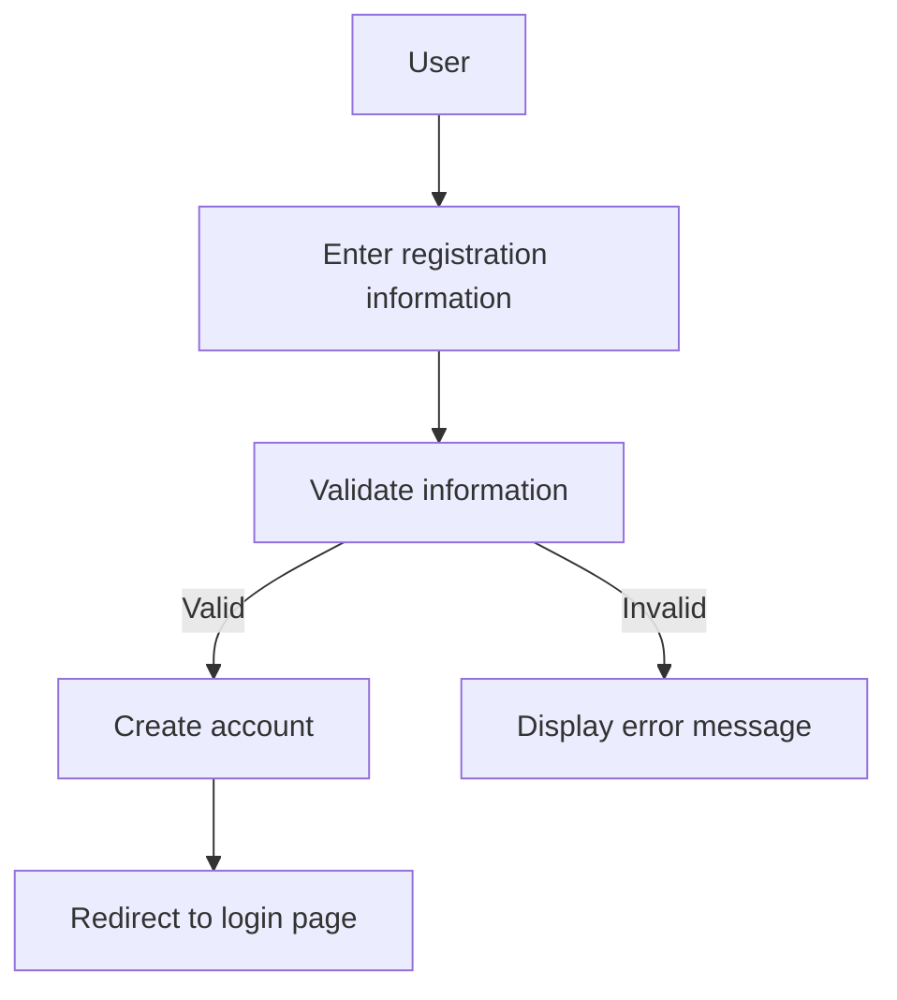
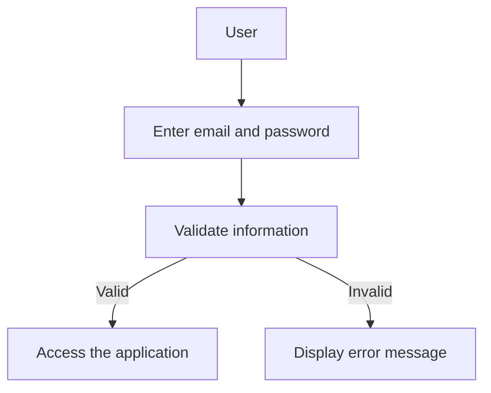
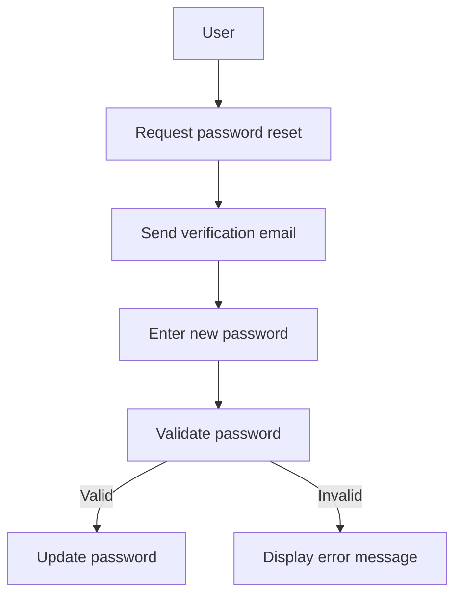
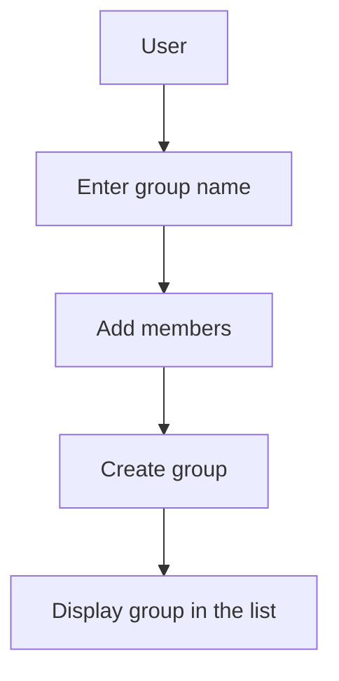
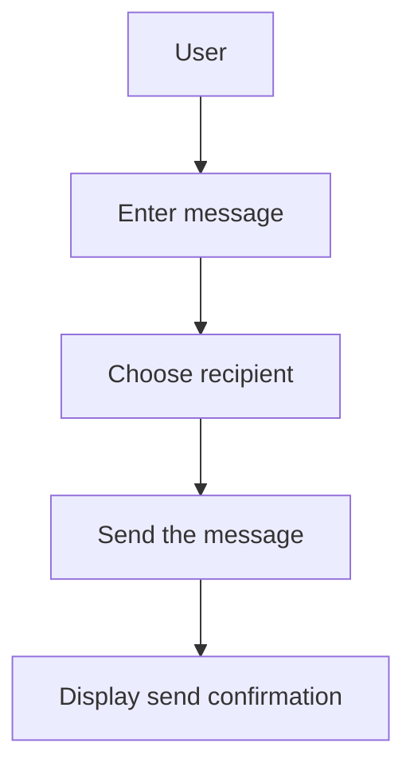
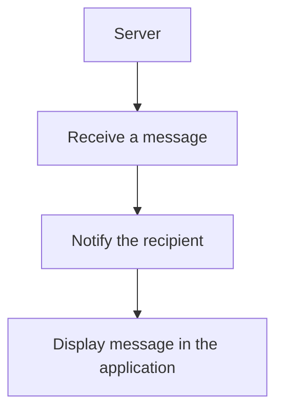
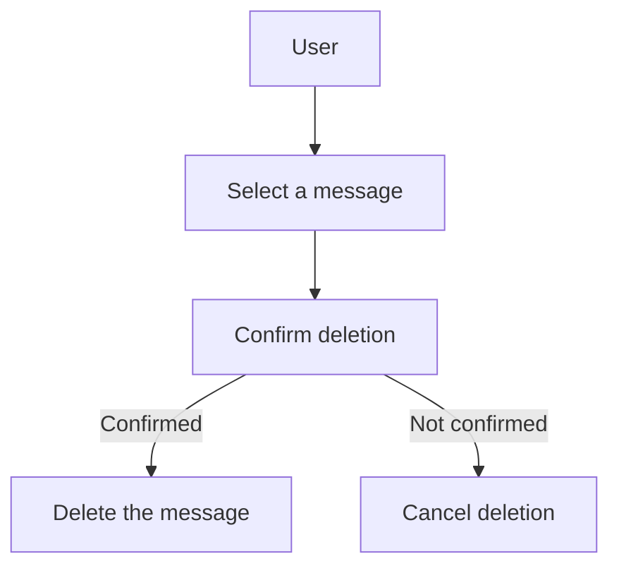
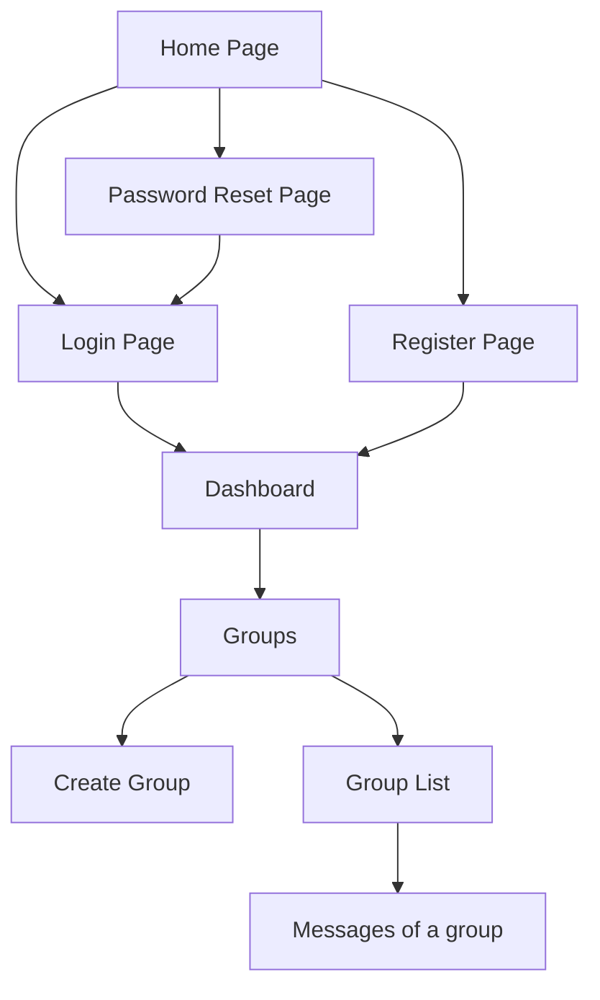

# Messenger

## Context

This project is a Symfony application developed to refresh my PHP and Symfony skills after several years of absence. It serves as a learning experience to explore concepts such as Clean Architecture, Test-Driven Development (TDD), Domain-Driven Design (DDD), and Hexagonal Architecture. These approaches aim to create maintainable, extensible, and testable code.

## Technologies

- **Symfony** : PHP framework for web application development.
- **PHP** : Programming language used for business logic.
- **Composer** : Dependency manager for PHP.
- **PHPUnit** : Tool for unit testing.
## Dependency

This project depends on the messenger-domain project, available at: [messenger-domain](https://github.com/thetis20/messenger-domain)

## Key Concepts

### 1. Clean Architecture

Clean Architecture is a set of principles designed to organize code in a way that is independent of frameworks, databases, and user interfaces. This enables:

* Separation of concerns.
* Easier testing.
* More comprehensible and maintainable code.

### 2. Test-Driven Development (TDD)

TDD is a development methodology based on writing tests before implementing functionality. The process involves three steps:

* Write a test that fails.
* Write the minimum code required to pass the test.
* Refactor the code while ensuring tests still pass.

TDD promotes code quality and reduces bugs.

### 3. Domain-Driven Design (DDD)

DDD is a software design approach that focuses on the business domain. It encourages collaboration between developers and domain experts to:

* Model the domain effectively.
* Use a common language.
* Structure code around business concepts.

### 4. Hexagonal Architecture

Hexagonal Architecture, also known as Ports and Adapters, separates the core application logic from external interactions (UI, databases, APIs, etc.). It allows:

* Easier testing of the application core.
* Replacement of external components without affecting business logic.
* Simplified application evolution.

## Installation

To install this project, follow these steps:

1. Clone the repository:
   ```bash
   git clone git@github.com:arnaud-factoryz/messenger.git
   cd messenger
   ```

2. Build & start docker:
   ```bash
   docker compose up -d
   ```
3. Install dependencies:
   ```bash
   composer install
   ```

4. Configure your environment:
 * Rename .env.example to .env and adjust settings as needed.
 * Configure KeyCloack

5. Create the database:
   ```bash
   bin/console doctrine:database:create
   ```
6. Run migrations:
   ```bash
   php b
7. Start server:
   ```bash
   symfony serve --no-tls
   ```

## License

This project is licensed under the MIT License. See the LICENSE file for more details.

## Use Cases

Key use cases:

### User Registration

A new user can register by providing information (name, email, password).



### User Login

A user can log in with email and password.



### Password Reset

A user can request a password reset and receive a verification email.


### Creating Discussion Groups

A user can create a group and add other users to it.



### Sending Messages

A user can send a message in a discussion group.


### Receiving Messages

A user receives messages sent by others.


### Viewing Message History

A user can view their conversation history.

### Deleting Messages

A user can delete sent or received messages.



## Sitemap




